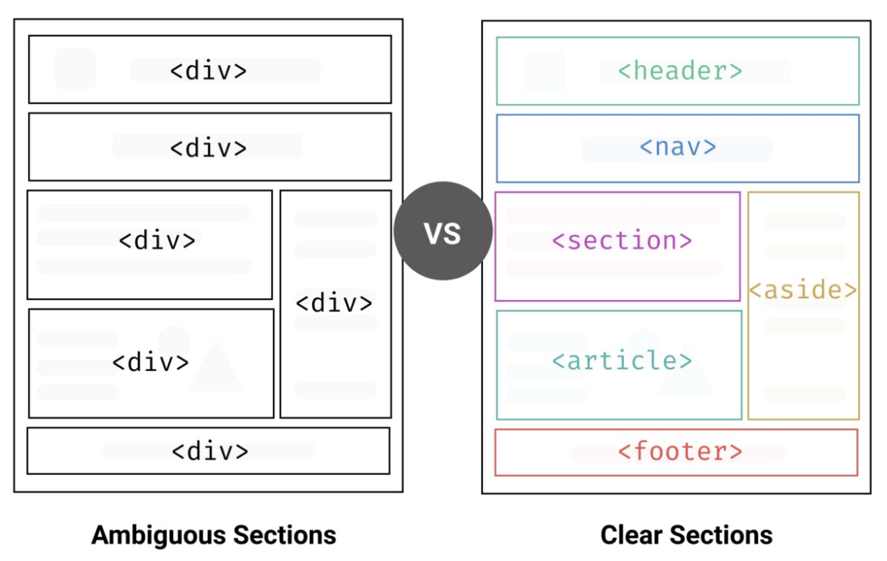

# Krazy K Nails Spa

### BY KERLIN

## Project Summary

This is a "mock" website of what I would create if I owned a nail business. The website is fully HTML & CSS only. I did it to show my HTML and CSS skills. I used semantic markup by using a HEADER, SECTION, ARTICLE, and FOOTER section.

## What is semantic markup in HTML?

"Semantic markup is a way of writing and structuring your HTML (Hypertext Markup Language) so that it reinforces the semantics, or meaning, of the content rather than its appearance."

#### Header Section:

- Logo
- Nav Bar
- Basically shows what I have to offer
- And what action they should take next

#### Section:

- This defines the info/bio of the nail tech.

#### Article Section:

- This element contains the main part, containing information about the services on the nail portfolio.

#### Footer Section:

- The footer defines a footer for a document or a section. Which informs this is just a HTML/CSS website and includes my github link

## List of technologies

 &nbsp;
 &nbsp;

## Resources

- Nail Info "https://resources.workable.com/nail-technician-job-description"
- Acrylic Info "https://www.harpersbazaar.com/beauty/nails/a31123254/acrylic-nails-what-to-know/"
- Gel X Info "https://www.makeup.com/nails/all-nails/what-is-gel-x-manicure"
- Pedicure Info "https://lesalon.com/blog/basics-pedicure/"
- Font Awesome Icon "https://fontawesome.com/"
- HTML Semantic Markup "https://www.simplilearn.com/tutorials/html-tutorial/html-semantics"
